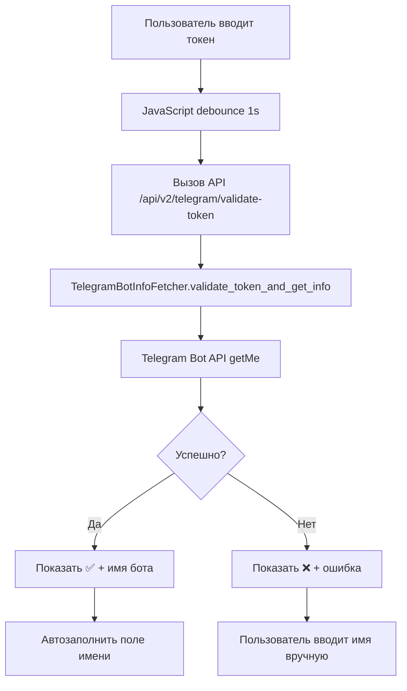

# 🤖 Автоматическое получение имени бота

## 🎯 Обзор

Новая функциональность автоматически получает имя бота из Telegram API при создании, избавляя пользователя от необходимости вручную вводить название.

## ✨ Возможности

### 🔄 Автоматическое определение имени
- **Источник данных**: Telegram Bot API (метод `getMe`)
- **Приоритет**: `first_name` → `username` → `Bot {ID}`
- **Fallback**: Если API недоступен, используется "Новый бот"

### 🌐 Веб-интерфейс
- **Валидация в реальном времени**: Проверка токена при вводе
- **Визуальная обратная связь**: Статус валидации с иконками
- **Автозаполнение**: Имя заполняется автоматически после ввода токена
- **Debounce**: API вызывается через 1 секунду после ввода

### 🔧 API интеграция
- **Новый endpoint**: `/api/v2/telegram/validate-token`
- **Автоматическая обработка**: В `POST /api/bots` и `POST /api/v2/bots`
- **Обратная совместимость**: Работает с существующими API

## 🚀 Как использовать

### Веб-интерфейс
1. Откройте http://localhost:5000/
2. Нажмите "Создать бота"
3. Введите Telegram токен в поле "Telegram Token"
4. Подождите 1 секунду - увидите статус валидации
5. Поле "Название бота" заполнится автоматически
6. Заполните остальные поля и создайте бота

### API
```bash
# Создание бота без указания имени
curl -X POST http://localhost:5000/api/v2/bots \
  -H "Content-Type: application/json" \
  -H "Authorization: Basic YWRtaW46YWRtaW4=" \
  -d '{
    "telegram_token": "1234567890:ABCD...",
    "openai_api_key": "sk-...",
    "assistant_id": "asst_..."
  }'

# Имя будет получено автоматически из Telegram API
```

### Валидация токена
```bash
# Проверка токена и получение информации о боте
curl -X POST http://localhost:5000/api/v2/telegram/validate-token \
  -H "Content-Type: application/json" \
  -H "Authorization: Basic YWRtaW46YWRtaW4=" \
  -d '{"token": "1234567890:ABCD..."}'

# Ответ:
{
  "status": "success",
  "data": {
    "valid": true,
    "display_name": "MyBot",
    "username": "@mybot",
    "bot_info": {...}
  }
}
```

## 🏗️ Архитектура

### Компоненты

#### 1. TelegramBotInfoFetcher
**Файл**: `core/utils/telegram_bot_info.py`

**Методы**:
- `get_bot_info(token)` - получить полную информацию о боте
- `get_bot_display_name(token)` - получить отображаемое имя
- `get_bot_username(token)` - получить username
- `validate_token_and_get_info(token)` - комплексная валидация
- `suggest_bot_name(token, fallback)` - предложить имя с fallback

#### 2. Веб-интерфейс
**Файл**: `src/templates/index.html`

**Функции JavaScript**:
- `validateTokenAndFetchBotName()` - валидация и получение имени
- `$(document).ready()` - инициализация обработчиков событий
- Debounce на поле ввода токена (1 секунда)

#### 3. API Endpoints
**Файл**: `src/app.py`

**Endpoints**:
- `POST /api/v2/telegram/validate-token` - валидация токена
- `POST /api/bots` - создание бота (legacy)
- `POST /api/v2/bots` - создание бота (v2)

### Логика работы



## 🔧 Конфигурация

### Timeout настройки
```python
# В TelegramBotInfoFetcher
TELEGRAM_API_TIMEOUT = 10  # секунд

# В JavaScript
TOKEN_VALIDATION_DEBOUNCE = 1000  # миллисекунд
```

### Fallback значения
```python
DEFAULT_BOT_NAME = "Новый бот"
FALLBACK_NAME_PATTERN = "Bot {bot_id}"
```

## 🛡️ Безопасность

### Валидация токена
- **Формат**: Проверка паттерна `bot_id:token_part`
- **Длина**: Минимальная длина токена
- **API вызов**: Реальная проверка через Telegram API

### Обработка ошибок
- **Таймаут**: 10 секунд на запрос к Telegram API
- **Graceful degradation**: Fallback к ручному вводу при ошибках
- **Логирование**: Все ошибки записываются в лог

## 📊 Статусы валидации

### Веб-интерфейс
- **🔄 Проверка токена...** - проверка в процессе
- **✅ [Имя бота]** - токен валиден, бот найден
- **❌ Неверный формат токена** - неправильный формат
- **❌ Ошибка проверки токена** - API ошибка

### API ответы
```json
// Успешная валидация
{
  "status": "success",
  "data": {
    "valid": true,
    "display_name": "MyBot",
    "username": "@mybot",
    "bot_info": {...}
  }
}

// Ошибка валидации
{
  "error": "Invalid token format",
  "success": false,
  "timestamp": "2025-01-22T18:00:00Z"
}
```

## 🧪 Тестирование

### Ручное тестирование
1. Откройте http://localhost:5000/
2. Нажмите "Создать бота"
3. Введите валидный токен
4. Проверьте автозаполнение имени

### API тестирование
```bash
# Тест валидации токена
curl -X POST http://localhost:5000/api/v2/telegram/validate-token \
  -H "Content-Type: application/json" \
  -H "Authorization: Basic YWRtaW46YWRtaW4=" \
  -d '{"token": "ВАШТОКЕН"}'

# Тест создания бота без имени
curl -X POST http://localhost:5000/api/v2/bots \
  -H "Content-Type: application/json" \
  -H "Authorization: Basic YWRtaW46YWRtaW4=" \
  -d '{
    "telegram_token": "ВАШТОКЕН",
    "openai_api_key": "sk-test",
    "assistant_id": "asst_test"
  }'
```

## 🔄 Обратная совместимость

### Существующий код
- **Без изменений**: Старый код продолжает работать
- **Опциональность**: Если `bot_name` указан, автоматическое получение не используется
- **API версии**: Поддерживаются и v1 и v2 API

### Миграция
Никаких изменений в существующих ботах не требуется. Функция активна только при создании новых ботов без указания имени.

## 📈 Преимущества

### Пользовательский опыт
- **Удобство**: Меньше полей для заполнения
- **Точность**: Имя берется напрямую из Telegram
- **Скорость**: Мгновенное автозаполнение

### Техническая реализация
- **Надежность**: Graceful degradation при ошибках
- **Производительность**: Debounce для минимизации API вызовов
- **Расширяемость**: Модульная архитектура

## 🚀 Возможные улучшения

### Будущие функции
- **Кэширование**: Кэш результатов валидации токенов
- **Batch validation**: Валидация нескольких токенов за раз
- **Расширенная информация**: Дополнительные поля из Telegram API
- **Предпросмотр аватара**: Показ аватара бота при валидации

### Интеграции
- **Bot Father**: Интеграция с @BotFather для получения описания
- **Webhook**: Автоматическая настройка webhook
- **Команды**: Получение списка команд бота

---

**💡 Совет**: При создании нового бота просто введите Telegram токен и подождите - имя заполнится автоматически!


